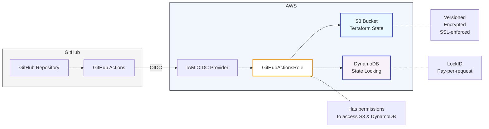

# Terraform Bootstrap Infrastructure

This CloudFormation `terraform-bootstrap.yml` template sets up the foundation for managing Terraform state and GitHub Actions integration.

## Overview



This stack creates:

- **S3 bucket** for Terraform state (versioned, encrypted, SSL-enforced)
- **DynamoDB table** for state locking
- **OIDC provider** for GitHub Actions integration
- **IAM role** with necessary permissions

## Quick Start

### Deploy the CloudFormation Stack

```bash
aws cloudformation create-stack \
  --stack-name terraform-backend-bootstrap \
  --template-body file://terraform-bootstrap.yaml \
  --capabilities CAPABILITY_NAMED_IAM
```

### Configure Terraform Backend

Use the stack outputs to configure your Terraform backend:

```terraform
terraform {
  backend "s3" {
    bucket         = "<TerraformStateBucketName-from-outputs>"
    key            = "<your-state-file-path>"
    region         = "<your-region>"
    dynamodb_table = "<TerraformLockDynamoDBTableName-from-outputs>"
    encrypt        = true
  }
}
```

### Configure GitHub Actions

Add this to your GitHub Actions workflow:

```yaml
permissions:
  id-token: write
  contents: read

jobs:
  deploy:
    runs-on: ubuntu-latest
    steps:
      - uses: actions/checkout@v3
      
      - name: Configure AWS Credentials
        uses: aws-actions/configure-aws-credentials@v2
        with:
          role-to-assume: <GitHubActionsRoleARN-from-outputs>
          aws-region: <your-region>
```

## Security Features

- Server-side encryption for S3 and DynamoDB
- SSL enforcement for S3 access
- Public access blocking
- OIDC authentication (no long-lived credentials)

## Parameters

| Parameter | Description | Default |
|-----------|-------------|--------|
| BucketNamePrefix | Prefix for S3 bucket name | dens-al |
| DynamoDBTableNamePrefix | Prefix for DynamoDB table name | dens-al |
| GitHubOrg | GitHub organization name | dens-al |
| GitHubRepo | Repository name/pattern | aws-terraform-gh-actions-bootstrap |
| GitHubRoleName | IAM role name | GitHubActionsRole |

## AWS Organisation

In case of using `AWS Organisation` it is good idea to use [Telophase](https://docs.telophase.dev/introduction) which can use CloudFormation or Terraform code as bootstrap script
